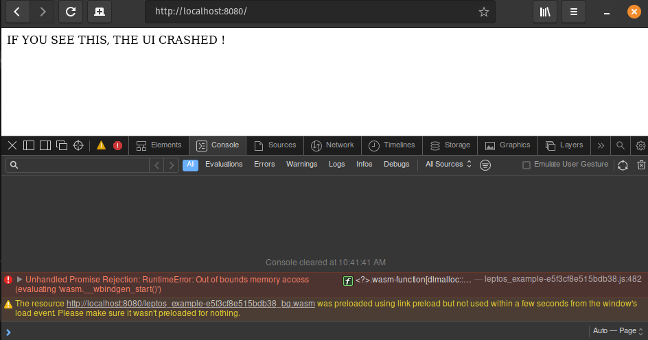

# wasm_pbm

### Following the issue described by @t0muxx in here :
- https://github.com/tauri-apps/tauri/issues/7154
- https://github.com/rustwasm/wasm-bindgen/issues/3470
- https://github.com/leptos-rs/leptos/issues/1153

- https://bugs.webkit.org/show_bug.cgi?id=259441

### Trying to have a minimalist reproducible example of the issue.



## Run examples :

```sh
cd leptos_example
trunk serve --open
```

open `http://locahost:8080` on you browser and wait for it to crash, then open the console to see the error.

## Results :

- :x: : crash
- :heavy_check_mark: : no crash

| OS | Chrome/Chromium/Edge | Firefox | Webkit/Epiphany/Safari
| --- | :---: | :---: | :---: |
| Ubuntu / PopOs | :heavy_check_mark: | :heavy_check_mark: | :x:
| Fedora 37 | :heavy_check_mark: | :heavy_check_mark: | :x:
| Mac M1 | :heavy_check_mark: | :heavy_check_mark: | :heavy_check_mark: 


## Multiple error messages the crash can produce :
- [Error] Unhandled Promise Rejection: RuntimeError: Unreachable code should not be executed (evaluating 'wasm.__wbindgen_start()')
- [Error] Unhandled Promise Rejection: RuntimeError: Out of bounds memory access (evaluating 'wasm.__wbindgen_start()')
- [Error] Unhandled Promise Rejection: Error: ret out of bounds
- **frozen browser** with CPU usage 100% (`webkit2gtk-4.1/WebKitWebProcess`)
- [Error] Unhandled Promise Rejection: RuntimeError: Out of bounds memory access (evaluating 'wasm.__wbindgen_start()')
- no error in the console, still the UI crashed


## Install Dependencies
```sh
cargo install trunk
```

webkit2gtk-4.1/WebKitWebProcess 